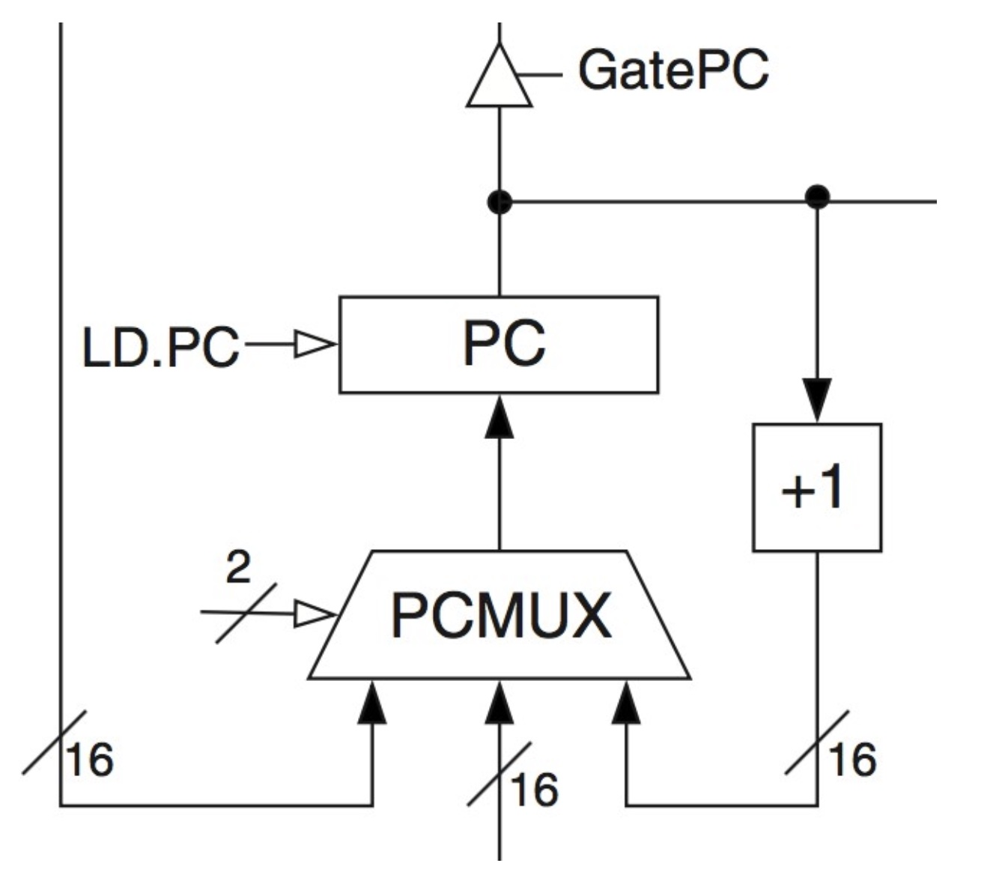

# **Week 5 Lectures**

<b>Table of Contents</b>: 

- [**Week 5 Lectures**](#week-5-lectures)
	- [**L06 [Von Neumann Model]**](#l06-von-neumann-model)
		- [**Exactly how did the FSM get that ADD instruction?**](#exactly-how-did-the-fsm-get-that-add-instruction)
		- [**What is a machine code program**](#what-is-a-machine-code-program)
		- [**Control Signals for PC Circuit**](#control-signals-for-pc-circuit)
		- [**FETCH and DECODE**](#fetch-and-decode)
		- [**Machine Code Instruction Cycle**](#machine-code-instruction-cycle)
		- [**ADD Instruction**](#add-instruction)

## **L06 [Von Neumann Model]**

### **Exactly how did the FSM get that ADD instruction?**

Before the FSM could execute the ADD instruction in the previous slides, it had to fetch the instruction from memory
- FETCH
- DECODE
- EXECUTE

The FSM fetches and decodes each instruction before it executes it.

### **What is a machine code program**
- Series of machine code instructions
- Each instruction is a 16-bit data value
- The instructions are stored in memory
  - Usually in sequence
  - Consecutive memory locations

The Program Counter (PC) register holds the address of the next instruction to be executed
- Which line in the program am I at?

The Instruction Register (IR) holds the instruction currently being executed

PCMUX
- Adder to increment PC (+1)
- Data from bus to PC
- Data from effective address calculator to PC

Usually, you execute code line by line, but sometimes you need conditionals and loops, which is what the mux is for

LD.PC = write enable for PC

GatePC puts the PC value on the bus

### **Control Signals for PC Circuit**
- GatePC (tri-state buffer)
- LD.PC (write enable for PC register)
- PC MUX (2 bit mux selector)
- 4 bits of control signal total

### **FETCH and DECODE**
Fetch
- Takes 3 cycles to read data from memory

Decode
- Takes 1 clock cycle
  - This is where the FSM generates the control signals for the specific instruction (such as ADD).

Total: 4 clock cycles (states) to fetch and decode an instruction

### **Machine Code Instruction Cycle**

1. Fetch
2. Decode
3. Evaluate Address*
4. Fetch Operands*
5. Execute*
6. Store Result*

* = optional

### **ADD Instruction**

ADD instruction only requires FETCH, DECODE, AND EXECUTE from the Machine Code Instruction Cycle.
